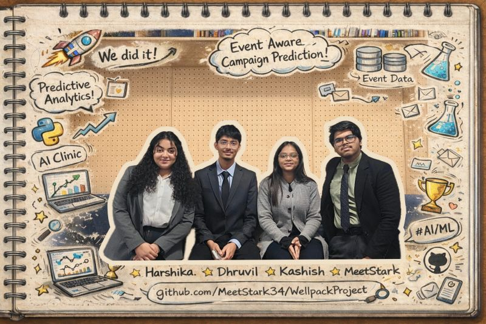

# 🎯 WellPack Prediction Event

> 🚀 Event-aware campaign prediction tool for WellPack
> 📅 Integrates local and national events to optimize SMS and RCS marketing timing
> ⚙️ Built with Next.js for the interface and Python for data analysis

---

<p align="center">
  
</p>
---

## 📖 Overview

**WellPack Prediction Event** is a hybrid **web + data science project** designed to enhance WellPack’s campaign prediction capabilities.

The core idea is simple: **campaign performance depends on context**.
Real-world events such as sports matches, cultural festivals, or public events strongly influence user attention and engagement.

This project combines:

* A **Next.js web interface** deployed on Vercel
* A **Python-based analysis layer** that studies event impact on campaign performance

Example:

* ⚽ A fast-food campaign sent before a football match may perform better
* 🏡 A real-estate campaign at the same time may be ignored

The system is designed to **account for these effects automatically**.

---

## 🎯 Objectives

* Integrate real-world event data into campaign prediction logic
* Detect relevant local or national events for a given campaign date
* Evaluate event impact by business sector
* Recommend optimal sending windows and messaging context
* Provide a clean and reusable project structure suitable for production

---

## 🧠 Methodology

1. **Data Exploration**
   Historical campaign data is explored using Python and Jupyter notebooks

2. **Event Context Analysis**
   Events are categorized (sports, culture, public events) and mapped to campaign sectors

3. **Impact Reasoning**
   Rules and metrics are defined to estimate positive or negative impact

4. **Visualization & Interpretation**
   Results are visualized and summarized to support decision making

---

## 🗂️ Repository Structure
### Main Branch 🪺🌿
```
WellpackProject/
│
├── web/                    # Next.js application (Vercel deployment)
│   ├── app/
│   ├── public/
│   │
│   ├── package.json
│   ├── js.config.json
│   ├── next.config.mjs
│   ├── package-lock.json
│   ├── eslint.config.mjs
│   └── postcss.config.mjs
│
├── notebooks/              # Python File & Jupyter notebooks (analysis & exploration)
│   ├── wellpack_analysis.py
│   └── wellpack_analysis.ipynb
│
├── data/                   # Raw datasets & Project PDFs
│   ├── Data.csv
│   ├── Project.pdf
│   └── Predict'IA screenshot.pdf
│
├── .gitignore
└── README.md
```
### Sub Folders 📂🌿
```
web/
├─ app/
│   ├── favicon.ico     # App icon used by the browser
│   ├── globals.css     # Global styles for the application
│   ├── layout.js       # Root layout (HTML structure, fonts, metadata)
│   └── page.js         # Main homepage of the application
│
└─ public/
    ├── campaigns.csv   # Dataset used by the frontend
    ├── file.svg        # Static SVG assets
    ├── globe.svg
    ├── next.svg
    ├── vercel.svg
    └── window.svg

```

---

## ⚙️ Tech Stack

**Frontend**

* Next.js
* JavaScript
* CSS
* Vercel

**Data & Analysis**

* Python
* Pandas
* Jupyter Notebook
* API-based data collection

---

## 🚀 Getting Started (Web App)

```bash
cd web
npm install
npm run dev
```

Then open:
[http://localhost:3000](http://localhost:3000)

---

## 🧪 Data Analysis

Install Python dependencies:

```bash
pip install -r requirements.txt
```

Open the notebook:

```bash
jupyter notebook notebooks/wellpack_analysis.ipynb
```

---

## 📌 Notes

* The `web/` folder is the Vercel root directory
* Data science components are intentionally separated from the frontend
* This structure reflects real-world production and analytics workflows

---
# 👥✨ Team
## 🚀 Core Contributors

🧠📊 **Lead Data & Logic Engineer**  
**Dhruvilsinh Rathod**  
>🔹 Event-impact logic & reasoning  
>🔹 Data processing and analytical workflows  
>🔹 Prediction rules and sector-based insights  

🔗 GitHub: [GitHub.com/Drathod-24](https://github.com/Drathod-24)  
📧 Email: [rathod.dhruvilsinh@aivancity.education](mailto:rathod.dhruvilsinh@aivancity.education)  

---

💻🎨🌐 **Web & Integration Developer**  
**Meet Patel (Stark)**  
>🔹 Next.js frontend development  
>🔹 Project architecture and repository structure  
>🔹 Vercel deployment and system integration  
>🔹 UI consistency and data presentation  

🔗 GitHub: [GitHub.com/MeetStark34](https://github.com/MeetStark34)  
📧 Email: [meet.patel@aivancity.education](mailto:meet.patel@aivancity.education)  

---

📝🧪✅ **Documentation & Quality Analyst**  
**Harshika Singh**  
>🔹 Technical documentation and README structure  
>🔹 Requirement tracking and clarity checks  
>🔹 Result validation and quality assurance  

🔗 GitHub: [GitHub.com/HarshikaOnGit](https://github.com/HarshikaOnGit)  
📧 Email: [harshika.singh@aivancity.education](mailto:harshika.singh@aivancity.education)  

---

🔍📚📈 **Research & Validation Associate**  
**Kashish Mahavar**  
>🔹 Background research and domain understanding  
>🔹 Data sanity checks and validation scenarios  
>🔹 Insight verification and edge-case testing  

🔗 GitHub: [GitHub.com/KashishMahavar](https://github.com/KashishMahavar)  
📧 Email: [kashish.mahavar@aivancity.education](mailto:kashish.mahavar@aivancity.education)  

---

# 🌟 Acknowledgements

Thanks to the WellPack team for insights into digital marketing, campaign data, and event-driven communication strategies.

---

**Turning events into insights... and insights into smarter campaigns.**

---

# ✨ Built with Curiosity, Collaboration, and a lot of Coffee ☕
